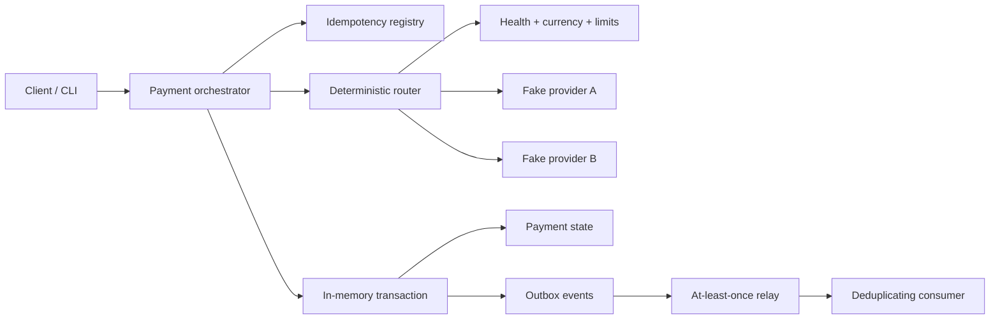
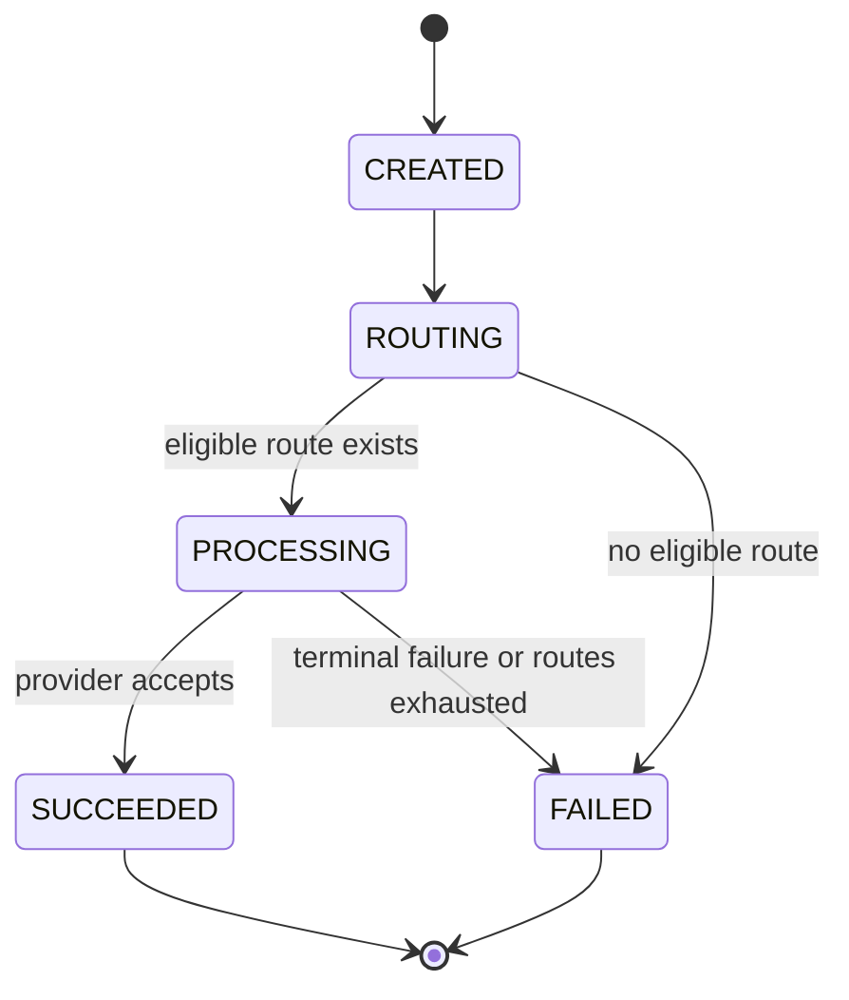

# Payment Orchestration Lab

A small, production-minded TypeScript reference implementation of the hard parts around a payment cascade: deterministic routing, idempotency, explicit state transitions, provider fallback, and reliable event delivery.

> **Synthetic project:** every provider, identifier, payment, failure, and event in this repository is fictional. The code was created as an independent reference implementation and contains no employer code, production data, private infrastructure details, credentials, or real provider integrations.

## What this demonstrates

- deterministic priority routing constrained by provider health, currency, and amount limits;
- idempotent payment creation, including concurrent duplicate calls in one process;
- safe rejection when the same idempotency key is reused with a different payload;
- retryable provider fallback and terminal-decline handling;
- an explicit, validated payment state machine;
- payment mutations and outbox events committed together in a transactional-style in-memory unit;
- at-least-once outbox relay semantics with downstream event-ID deduplication;
- deterministic fake providers and failure injection for repeatable tests.

## Architecture



The database transaction callback is synchronous by design. It clones the current state, applies both the aggregate change and its event, and swaps the candidate state in only if the callback completes. Network work happens outside the transaction.

## Payment state machine



An invalid shortcut such as `CREATED -> SUCCEEDED` raises `InvalidPaymentTransitionError`. Provider attempts are recorded while the payment remains in `PROCESSING`, so a cascade does not invent extra aggregate states.

## Routing and cascade

The router first removes providers that are:

1. unhealthy;
2. incompatible with the requested currency;
3. outside their inclusive minimum/maximum amount limits.

Eligible providers are sorted by ascending numeric priority. Equal-priority providers use an ASCII provider-ID tie-breaker, making route order independent of registration order.

The orchestrator calls each route once. A retryable failure or thrown provider error advances the cascade. A non-retryable failure stops it. Attempt IDs are derived from payment ID, provider ID, and sequence; fake providers cache results by attempt ID to model an idempotent downstream API.

## Idempotency

The idempotency record stores a SHA-256 fingerprint of the canonical business payload (`amountMinor`, normalized `currency`, and `merchantReference`).

- Same key + same payload returns the original payment and does not call a provider again.
- Same key + different payload raises `IdempotencyConflictError`.
- Concurrent duplicates handled by the same orchestrator instance share one in-flight promise.
- The idempotency binding, initial payment, and `payment.created` event are written in one in-memory transaction.

The key itself is deliberately excluded from its request fingerprint because it is the lookup identity, not payment content.

## Outbox delivery semantics

Each state change and provider-attempt mutation stores an event beside the aggregate mutation. The relay:

1. reads unpublished events;
2. records a delivery attempt;
3. publishes downstream;
4. marks the event published only after acknowledgement.

If the process fails after downstream handling but before step 4, the event is delivered again. `DeduplicatingEventConsumer` retains processed event IDs and therefore applies the event only once. The failure-injection test reproduces this ambiguous outcome explicitly.

## Run locally

Requirements: Node.js 22 or newer and npm.

```bash
npm install
npm run demo
npm test
npm run typecheck
npm run build
```

Or run the complete CI-equivalent verification:

```bash
npm run check
```

The demo intentionally makes the first provider return a retryable timeout, succeeds through the backup provider, repeats the request with the same idempotency key, and relays the resulting outbox events.

## Expected failure behavior

| Condition | Result |
| --- | --- |
| No healthy provider supports currency/amount | `FAILED / NO_HEALTHY_ROUTE`, zero provider calls |
| Provider throws or is temporarily unavailable | recorded as retryable `PROVIDER_UNAVAILABLE`, cascade continues |
| All eligible routes fail retryably | `FAILED / ROUTES_EXHAUSTED` |
| Provider returns a terminal decline | cascade stops, `FAILED / PROVIDER_REJECTED` |
| Idempotency key is reused for different content | request rejected without changing the original payment |
| Relay fails before acknowledgement | event remains pending and is replayed |
| Downstream receives a replay | duplicate event ID is ignored |

## Guarantees in this reference implementation

- Amounts use integer minor units; floating-point money is never accepted.
- Payment transitions are checked at runtime and terminal states cannot transition further.
- Routing is deterministic for a fixed provider-health snapshot and request.
- One database mutation and its outbox event either both commit or neither commits.
- A settled idempotent retry never repeats provider calls.
- Relay delivery is at least once; the included consumer achieves an effectively-once side effect by event-ID deduplication.

## Deliberate non-guarantees

This is an executable design sample, not a payment product. It deliberately does **not** provide:

- durable storage, distributed transactions, distributed locks, or multi-node in-flight coordination;
- real PSP connectivity, PCI-DSS controls, tokenization, authentication, or secret management;
- authorization/capture separation, refunds, disputes, FX, fees, reconciliation, or settlement;
- health-check freshness policies, circuit breakers, rate limits, timeouts, backoff, or retry scheduling;
- an HTTP API, access control, observability backend, schema migration strategy, or production SLOs;
- unbounded relay processing, dead-letter queues, event schema versioning, or durable consumer dedup storage.

A production evolution would replace the in-memory unit with a relational transaction, put a unique constraint on the idempotency key, use row leasing or `SKIP LOCKED` for relay workers, persist consumer inbox IDs, version event schemas, and run provider calls behind bounded timeouts and circuit breakers.

## Project map

```text
src/
  application/       orchestration, routing, ports
  domain/            payment aggregate, errors, state machine
  infrastructure/    fake providers, in-memory transaction, outbox relay
  demo.ts             executable cascade and idempotency example
test/                 behavior and failure-mode tests
.github/workflows/    typecheck, test, and build on every change
```

## License

MIT. See [LICENSE](LICENSE).
